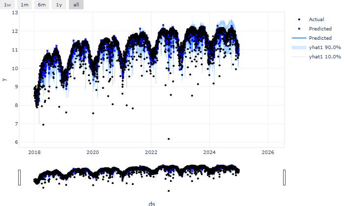

## 1. 연구 배경 및 데이터 설명

### 1.1 연구 배경

서울시 공공자전거 따릉이는 2015년 도입된 이후 시민들의 친환경 교통수단으로 자리잡았으며, 특히 코로나19 팬데믹 이후 개인 이동수단에 대한 관심이 증대되면서 이용량이 급격히 증가하고 있다. 따릉이 이용 패턴을 정확히 예측하는 것은 효율적인 자전거 배치, 정비 계획 수립, 그리고 도시 교통 정책 수립에 중요한 의사결정 근거를 제공한다.

본 연구는 시계열 예측 모델을 활용하여 따릉이 일별 이용량을 예측하고, 각 모델의 성능을 비교 분석함으로써 최적의 예측 모델을 도출하고자 한다.

### 1.2 데이터 설명

- **데이터 기간**: 2018년 1월 1일 ~ 2024년 12월 31일 (총 2,557일)
- **데이터 빈도**: 일별(Daily)
- **변수**: 날짜(date), 일별 대여 건수(rental)
- **데이터 특성**:
  - 주말/주중, 공휴일, 계절, 강수 등에 따른 패턴 존재
  - 코로나19 등 외부 충격으로 인한 구조적 변화점 존재
- **전처리**: 로그 변환을 통한 분산 안정화 및 결측치(1일) 보간 처리

_그림 1: 서울시 따릉이 일별 이용량 원시 데이터 (2018-2024)_

_그림 2: 로그 변환된 따릉이 일별 이용량 데이터_

## 2. 각 모델 적합 결과 및 성능 비교

| 모델          | RMSE   | MAPE  | sMAPE | CRPS   |
| ------------- | ------ | ----- | ----- | ------ |
| Prophet       | 0.3998 | 2.25% | 2.20% | 0.2096 |
| NeuralProphet | 0.3998 | 2.18% | 2.20% | 0.2224 |

| 모델                  | MAPE  |
| --------------------- | ----- |
| Prophet               | 2.25% |
| Prophet (강수량 포함) | 1.97% |

### 주요 결과:

- **날씨 요인의 중요성**: 강수량 데이터 추가로 Prophet 모델의 성능이 크게 개선 (2.25% → 1.97%)
- **NeuralProphet의 한계**: 딥러닝 모델임에도 불구하고 압도적인 성능 우위를 보이지 못함
- **Changepoint 민감도**: 변화점을 과도하게 감지(18개)하면 오버피팅 위험이 있으나, 적절한 수준(7개)에서는 성능 향상 효과

_그림 3: Prophet 모델의 예측 결과 및 실제값 비교_

_그림 4: Prophet 모델의 전체 시계열 예측_

_그림 5: Prophet 모델의 트렌드, 계절성, 휴일 효과 분해 결과_

_그림 6: Future Regressor를 포함한 Prophet 모델 예측 결과_

_그림 7: NeuralProphet 모델의 예측 결과_

## 3. Change Point 및 이상징후 분석 결과

### 3.1 Change Point 분석

Prophet 모델의 changepoint_prior_scale 파라미터 조정을 통한 변화점 감지 분석을 수행하였다:

| Changepoint Prior Scale | 변화점 개수 | MAE    | MAPE  |
| ----------------------- | ----------- | ------ | ----- |
| 0.01                    | 8개         | 0.2723 | 2.46% |
| 0.10                    | 7개         | 0.2474 | 2.24% |
| 0.50                    | 18개        | 0.2402 | 2.18% |

**Changepoint 분석 결과:**

- **적절한 민감도**: 0.10 설정에서 7개의 변화점이 감지되어 가장 균형 잡힌 성능 달성
- **과적합 위험**: 0.50 설정에서 18개의 과도한 변화점 감지로 오버피팅 가능성 존재
- **성능 개선 한계**: 변화점을 늘려도 실질적인 예측 성능 개선은 제한적

_그림 8: Changepoint Prior Scale에 따른 성능 비교_

_그림 9: 각 Changepoint Prior Scale별 예측 결과 및 변화점 탐지_

### 3.2 주요 Change Point 및 이상징후

1. **2020년 2-3월**: 코로나19 초기 확산으로 인한 급격한 이용량 감소
2. **2020년 중반**: 사회적 거리두기 완화에 따른 점진적 회복
3. 모델이 감지한 주요 이상치들은 대부분 외부 환경 요인(날씨, 사회적 이슈)과 연관됨

## 4. 모델별 강·약점 분석 및 정책적·실무적 시사점

### 모델별 강·약점 분석

### Prophet 모델

**강점:**

- 직관적이고 해석 가능한 결과 제공
- 휴일 효과와 계절성 자동 감지
- 안정적인 성능과 빠른 학습 속도
- **외부 변수 추가 시 큰 성능 향상 (2.25% → 1.97%)**

**약점:**

- 기본 상태에서는 복잡한 비선형 패턴 포착 한계
- 단기 변동성 예측 정확도 상대적으로 낮음

### NeuralProphet 모델

**강점:**

- Prophet의 해석 가능성을 유지하면서 딥러닝 기법 적용
- 복잡한 패턴 학습 이론적 능력 보유

**약점:**

- **기대 대비 제한적인 성능 개선** (Prophet 대비 미미한 향상)
- 상대적으로 긴 학습 시간
- 단순 모델 대비 비용 대비 효과성 의문

### Future Regressors (강수량) 모델

**강점:**

- **압도적인 성능 개선** (가장 높은 예측 정확도 MAPE 1.97%)
- 날씨라는 직관적이고 중요한 외부 요인 반영
- 도메인 지식 활용으로 실질적 개선 달성

**약점:**

- 미래 외부 변수 예측의 불확실성
- 모델 복잡도 증가

### 정책적 시사점

1. **자전거 배치 최적화**

   - 예측 모델을 활용한 권역별 수요 예측으로 효율적 자전거 배치 가능
   - 계절별, 요일별 패턴을 고려한 동적 배치 전략 수립

2. **정비 및 운영 계획**

   - 이용량 예측을 통한 예방적 정비 계획 수립
   - 피크 시간대 대비 운영진 배치 최적화

3. **정책 영향 평가**
   - 새로운 정책 도입 시 이용량 변화 사전 시뮬레이션
   - 코로나19와 같은 외부 충격에 대한 대응 전략 수립

### 실무적 시사점

1. **최우선 모델**: Prophet + 강수량 데이터 활용 권장 (최고 정확도 MAPE 1.97%)
2. **비용 효율성**: 복잡한 딥러닝 모델보다 적절한 외부 변수 선택이 더 효과적
3. **날씨 정보 활용**: 기상 데이터 통합이 공공자전거 수요 예측에 필수적
4. **변화점 모니터링**: 과도한 민감도보다는 적절한 수준의 변화점 감지가 중요

## 5. 결론 및 향후 연구과제

본 연구는 서울시 공공자전거 따릉이의 2018-2024년 데이터를 활용하여 Prophet, NeuralProphet, Future Regressors 모델의 예측 성능을 비교 분석하였다. Prophet + 강수량 데이터 조합이 MAPE 1.97%로 가장 우수한 성능을 보였으며, 복잡한 딥러닝 모델보다 도메인 지식에 기반한 외부 변수 선택이 더 중요함을 확인하였다. 이는 비용 효율적인 예측 시스템 구축에서 모델 복잡도보다 적절한 변수 선택이 핵심임을 시사한다.

향후 연구과제로는 실시간 날씨 데이터와 교통 정보를 통합한 예측 시스템 개발, 시간별·권역별 세분화된 예측 모델 구축, 그리고 신규 대여소 입지 선정을 위한 정책 연구 확장이 필요하다. 이를 통해 공공자전거 시스템의 지속가능한 발전과 시민들의 친환경 교통수단 이용 증진에 기여할 수 있을 것으로 기대된다.
