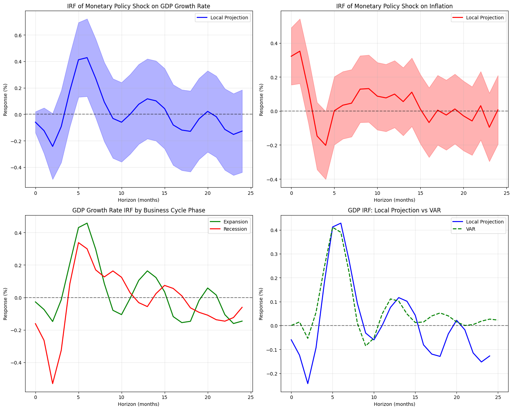

# 미국 통화정책 효과 분석: Local Projection과 VAR 모형 비교

## Taylor Rule 추정

```
FFR_t = α + β₁×인플레이션_t-1 + β₂×산출갭_t-1 + β₃×FFR_t-1 + ε_t
```

- R²: 0.994
- 인플레이션 계수: 0.0718 (p<0.05)
- 산출갭 계수: 0.0994 (p<0.001)
- 금리 지속성: 0.9907 (p<0.001)

통화정책 충격(ε_t)의 표준편차는 0.178로 추정되었다.



## Local Projection 분석 결과

### 실질 GDP 성장률에 대한 효과

| 개월 | 월별 효과 | 누적 효과 | 유의성 |
| ---- | --------- | --------- | ------ |
| 0    | -0.0597%  | -0.0597%  |        |
| 1    | -0.1241%  | -0.1838%  |        |
| 2    | -0.2430%  | -0.4268%  | \*     |
| 3    | -0.0929%  | -0.5197%  |        |
| 4    | 0.1774%   | -0.3423%  |        |
| 5    | 0.4120%   | 0.0696%   | \*\*\* |
| 6    | 0.4281%   | 0.4977%   | \*\*\* |
| 7    | 0.2715%   | 0.7692%   | \*     |
| 8    | 0.0924%   | 0.8616%   |        |
| 9    | -0.0316%  | 0.8300%   |        |
| 10   | -0.0601%  | 0.7700%   |        |
| 11   | 0.0001%   | 0.7700%   |        |
| 12   | 0.0757%   | 0.8457%   |        |
| 13   | 0.1167%   | 0.9624%   |        |
| 14   | 0.1014%   | 1.0638%   |        |
| 15   | 0.0429%   | 1.1066%   |        |
| 16   | -0.0809%  | 1.0257%   |        |
| 17   | -0.1196%  | 0.9061%   |        |
| 18   | -0.1292%  | 0.7769%   |        |
| 19   | -0.0349%  | 0.7420%   |        |
| 20   | 0.0218%   | 0.7638%   |        |
| 21   | -0.0181%  | 0.7456%   |        |
| 22   | -0.1146%  | 0.6310%   |        |
| 23   | -0.1525%  | 0.4784%   |        |
| 24   | -0.1274%  | 0.3510%   |        |

**단기 효과 (0-6개월)**:

- 평균 반응: 0.0711%
- 긴축적 통화정책 충격 직후 GDP 성장률이 일시적으로 하락(-0.0597%)
- 2개월째 최대 하락(-0.2430%)
- 5-6개월째부터 양(+)의 효과로 전환

**중기 효과 (7-24개월)**:

- 평균 반응: -0.0081%
- 7개월째 일시적 상승(0.2715%) 후 점진적 감소
- 장기적으로는 미미한 음(-)의 효과 지속

**누적 효과**:

- 24개월 누적 효과: 0.3510%
- 초기 6개월간 누적 하락 후 회복세로 전환
- 통화정책의 GDP에 대한 효과는 제한적이며 일시적

### 인플레이션에 대한 효과

| 개월 | 월별 효과 | 누적 효과 | 유의성 |
| ---- | --------- | --------- | ------ |
| 0    | 0.3222%   | 0.3222%   | \*\*\* |
| 1    | 0.3522%   | 0.6743%   | \*\*\* |
| 2    | 0.1215%   | 0.7958%   |        |
| 3    | -0.1471%  | 0.6487%   |        |
| 4    | -0.2021%  | 0.4466%   | \*\*   |
| 5    | 0.0017%   | 0.4483%   |        |
| 6    | 0.0344%   | 0.4827%   |        |
| 7    | 0.0461%   | 0.5287%   |        |
| 8    | 0.1289%   | 0.6576%   |        |
| 9    | 0.1320%   | 0.7896%   |        |
| 10   | 0.0872%   | 0.8768%   |        |
| 11   | 0.0771%   | 0.9539%   |        |
| 12   | 0.0996%   | 1.0535%   |        |
| 13   | 0.0553%   | 1.1088%   |        |
| 14   | 0.1109%   | 1.2197%   |        |
| 15   | 0.0103%   | 1.2300%   |        |
| 16   | -0.0678%  | 1.1622%   |        |
| 17   | 0.0051%   | 1.1673%   |        |
| 18   | -0.0236%  | 1.1437%   |        |
| 19   | 0.0121%   | 1.1557%   |        |
| 20   | -0.0285%  | 1.1272%   |        |
| 21   | -0.0585%  | 1.0687%   |        |
| 22   | 0.0313%   | 1.1000%   |        |
| 23   | -0.0956%  | 1.0045%   |        |
| 24   | 0.0071%   | 1.0116%   |        |

**단기 효과 (0-6개월)**:

- 평균 반응: 0.0690%
- 즉시 강한 양(+)의 반응(0.3222%)
- "Price Puzzle" 현상: 긴축 통화정책 직후 인플레이션 상승

**중기 효과 (7-24개월)**:

- 평균 반응: 0.0294%
- 4개월째부터 점진적 하락 시작
- 장기적으로는 양(+)의 수준 유지

**누적 효과**:

- 24개월 누적 효과: 1.0116%
- 초기 Price Puzzle 이후 점진적 안정화
- 인플레이션에 대한 통화정책 효과는 지속적

## 경기 국면별 비대칭적 효과

### 조건부 분석 결과

- **확장기 평균 반응**: 0.1190%
- **침체기 평균 반응**: -0.0800%
- **비대칭성**: -0.1991%p (침체기-확장기)

### 해석

침체기에 통화정책의 효과가 더 크게 나타나는 것은 다음과 같이 해석된다:

- 경기 침체기 시 기업과 가계의 유동성 제약이 강화
- 신용경로(credit channel)를 통한 통화정책 전달효과 증대
- 불확실성 증가로 인한 예방적 저축 동기 강화

## VAR 모형과의 비교

### VAR(6) 모형 추정

- **최적 래그**: 6개월 (AIC 기준)
- **모형 적합도**: Log-likelihood = 685.877

### 비교 결과

- **Local Projection (단기)**: 0.0711%
- **VAR (단기)**: 0.1515%
- **차이**: 0.0804%p

두 방법론 모두 유사한 동적 패턴을 보이나, VAR 모형이 약간 더 큰 효과를 추정한다.
